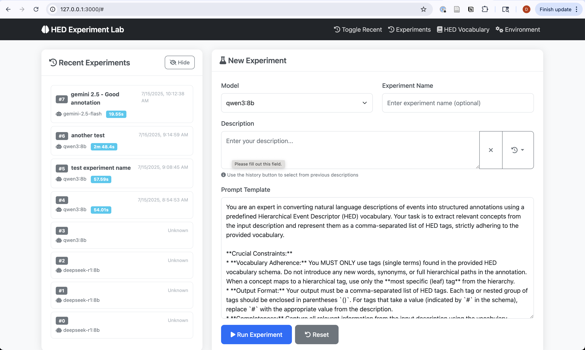

# HED Experiment Lab

A web application for experimenting with Hierarchical Event Descriptor (HED) vocabulary annotations using various AI models. This tool allows researchers to test different prompts, compare model responses, and systematically evaluate HED annotation quality.



## Features

- **Multi-Model Support**: Compatible with both Ollama (local) and Google Gemini (cloud) models
- **Interactive Web Interface**: User-friendly interface for running experiments
- **Experiment Management**: Automatic saving and organization of all experiments
- **HED Vocabulary Editor**: Built-in editor for modifying HED vocabulary
- **Description History**: Reuse previous descriptions from experiment history
- **Inference Time Tracking**: Monitor model performance metrics
- **Experiment Naming**: Organize experiments with custom names
- **Auto-Save**: All experiments are automatically saved to the filesystem
- **HED Validation**: Automatic validation of generated annotations with issue counting and quality metrics

## Getting Started

### Prerequisites

- Python 3.8 or higher
- [uv](https://github.com/astral-sh/uv) package manager
- Google Gemini API key (if using Gemini models)
- Ollama installed locally (if using Ollama models)
- HED Python package for annotation validation

### Installation

1. **Install uv package manager**:
   ```bash
   # On macOS/Linux
   curl -LsSf https://astral.sh/uv/install.sh | sh
   
   # On Windows
   powershell -c "irm https://astral.sh/uv/install.ps1 | iex"
   ```

2. **Clone the repository**:
   ```bash
   git clone https://github.com/dungscout96/prompt-experiment.git
   cd prompt-experiment
   ```

3. **Set up environment variables**:
   Create a `.env` file in the project root and add your Google Gemini API key:
   ```bash
   GEMINI_API_KEY=your_gemini_api_key_here
   ```

4. **Install dependencies**:
   ```bash
   uv sync
   ```

### Running the Application

1. **Navigate to the web folder**:
   ```bash
   cd web
   ```

2. **Start the application**:
   ```bash
   uv run app.py
   ```

3. **Open your browser** and navigate to:
   ```
   http://localhost:5000
   ```

### Setting Up Models

#### Ollama Models (Local)
1. Install Ollama from [ollama.ai](https://ollama.ai)
2. Pull your desired models:
   ```bash
   ollama pull qwen3:8b
   ollama pull llama3:8b
   ollama pull mistral:7b
   ```

#### Google Gemini Models (Cloud)
1. Get an API key from [Google AI Studio](https://aistudio.google.com/app/apikey)
2. Add the key to your `.env` file as shown above

## Usage

### Running Experiments

1. **Select a Model**: Choose from available Ollama or Gemini models
2. **Enter Experiment Name**: Optional name for organizing your experiments
3. **Provide Description**: Enter the text you want to annotate with HED tags
4. **Customize Prompt**: Modify the prompt template if needed
5. **Run Experiment**: Click "Run Experiment" to execute

### Features Overview

- **Recent Experiments Panel**: View and manage your experiment history (can be hidden/shown)
- **Description History**: Reuse previous descriptions with usage count tracking
- **HED Vocabulary Editor**: Edit the HED vocabulary XML schema
- **Experiment Details**: View detailed information about any experiment
- **Auto-Save**: All experiments are automatically saved with unique IDs
- **HED Validation**: Automatic validation of generated annotations with quality metrics
  - Real-time validation of extracted annotations
  - Issue counting and color-coded quality indicators
  - Green: 0 issues, Yellow: 1-3 issues, Red: >3 issues
  - Detailed validation results shown in experiment details

### File Structure

```
prompt-experiment/
├── web/
│   ├── app.py              # Flask web application
│   ├── templates/
│   │   └── index.html      # Main web interface
│   └── static/
│       ├── script.js       # Frontend JavaScript
│       └── style.css       # Custom styling
├── prompt_experiments/     # Auto-generated experiment files
│   ├── experiment_0.json
│   ├── experiment_1.json
│   └── ...
├── HED_vocab_reformatted.xml  # HED vocabulary schema
├── pyproject.toml          # Project dependencies
└── README.md
```

## Experiment Data

All experiments are automatically saved in the `prompt_experiments/` folder with the following structure:

```json
{
  "experiment_id": 0,
  "experiment_name": "My First Experiment",
  "model": "qwen3:8b",
  "description": "The user input description",
  "prompt_template": "The full prompt template used",
  "model_response": "The model's response",
  "annotation": "(Action, Visual), (Object, Human)",
  "validation_issues": 2,
  "inference_time": 2.34,
  "timestamp": "2025-01-15T10:30:00.123456",
  "prompt": "The complete rendered prompt sent to the model"
}
```

### Experiment Files

- **Automatic Naming**: Files are named `experiment_N.json` where N is an auto-incrementing ID
- **Persistent Storage**: All experiments are saved to disk automatically
- **Unique IDs**: Each experiment has a unique, sequential ID that cannot be changed
- **Editable Names**: Experiment names can be edited after creation
- **Sorting**: Recent experiments are sorted by ID (most recent first)

## API Endpoints

The application provides several REST API endpoints:

- `GET /api/models` - Get available models
- `POST /api/run_experiment` - Run a new experiment
- `GET /api/experiments` - Get all experiments
- `GET /api/experiment/<filename>` - Get specific experiment
- `POST /api/update_experiment_name` - Update experiment name
- `GET /api/descriptions` - Get description history
- `GET /api/hed_vocab` - Get HED vocabulary
- `POST /api/hed_vocab` - Save HED vocabulary

## Troubleshooting

### Common Issues

1. **Models not loading**: Ensure Ollama is running and models are pulled
2. **Gemini API errors**: Check your API key in the `.env` file
3. **Port already in use**: The app runs on port 5000 by default
4. **Missing dependencies**: Run `uv sync` to install all dependencies

### Development

To run in development mode:

```bash
cd web
uv run app.py
```

The application will run with debug mode enabled and auto-reload on file changes.

## Contributing

1. Fork the repository
2. Create a feature branch
3. Make your changes
4. Submit a pull request

## License

This project is licensed under the MIT License.
